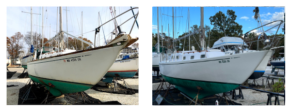

# Select Projects #

### Winch block refurbishing ###

{: .gallery-image :}

This project is part of a larger plan to refurbish the coamings and other
brightwork in the cockpit. When we disassembled the coamings I discovered significant
rot in one of the jib winch blocks. After sanding off the old varnish I used penetrating
epoxy to repair the rot, reinforce other weak spots in both blocks, and faired the bases to mate perfectly
with the deck. Then I sealed the winch blocks with epoxy and applied multiple coats of varnish.
[Read more](projects/coamings/2021-02-01-winch-blocks.html).

### Replacement hatch cover ###

{: .gallery-image :}

A brief attempt to repair a shaky hatch cover soon turned into a full replacement using
fiberglass and a custom mold. Major challenges included getting the dimensions just right
and ensuring that the hatch opened smoothly and closed snugly.
[Read more](projects/hatch-cover/2021-01-01-overview.html).

### Hull repaint ###

{: .gallery-image :}

The existing Awlgrip paint job was at least 25 years old and failing in several spots, exposing
the original gelcoat beneath. I sanded the hull back to gelcoat, filled several dozen holes
and other imperfections, faired, primed, and painted with Alexseal (rolling only, no tipping).
I'm still working on the boot and cove stripes.
[Read more](projects/hull/2020-07-01-overview.html).

### Custom instrument panel ###

{: .gallery-image :}

This project replaces an OEM plastic instrument panel mounted on aging plywood with
one made of new mahogany plywood within an inset mahogany frame. I also wanted to replace
some unused instruments, untangle a few decades worth of convoluted wiring, and--literally--add
a few new bells and whistles. The new setup also includes a properly wired engine alarm
with the instrument circuits wired through a bus bar for simplicity
and an extra switch to toggle the backlight on the cockpit compass. The plywood and frame
are sealed with clear epoxy and varnished. Not shown is a wrap-around mahogany cover held
in place with magnets that attach to the brass rivets.
