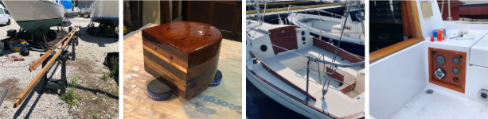

# Projects #

{: .thumbnail-gallery :}

This section is a collection of posts I write on select projects. Some are
relatively small, completed over a days or a couple of weeks; others are multi-year
renovations. It includes both work for clients and work on my own boat, an 
[Allied Seabreeze](http://www.alliedseabreeze35.org/) (hull #62).
I try to include as much detail as possible: photos, product links,
alternate approaches, and lessons learned.

I also post on [Facebook]({{ site.contact.fbook }}) and [Instagram]({{ site.contact.insta }})
and tend to post there more frequently. Follow those pages for the most
recent updates.

I hope you find this information useful.
Feel free to [contact me with questions]({{ site.contact.email }}).

**Jump to:**  
<a href="#recent" class="btn btn-primary btn-sm">Recent work</a>
<a href="#seabreeze" class="btn btn-primary btn-sm">Seabreeze</a>
<a href="#fiberglass" class="btn btn-primary btn-sm">Fiberglass</a>
<a href="#woodworking" class="btn btn-primary btn-sm">Woodworking</a>
<a href="#canvas" class="btn btn-primary btn-sm">Canvas</a>
{: .center .jump-links :}

## Recent Work ## {#recent}

For my most recent posts, check out
[Facebook]({{ site.contact.fbook }}) or [Instagram]({{ site.contact.insta }}).

<ul>


  <li><a href="{{ post.url | relative_url }}">{{ post.listTitle | default: post.title }}</a> ({{ post.listDate | date: "%b, %Y" }})</li>

</ul>

## Projects by Category ##



<h3 id="{{ tag[0] | replace: " ", "-" | replace: "_", "" | downcase }}">{{ tag[0] | replace: "_", " " }}</h3>
<ul>

  <li><a href="{{ post.url | relative_url }}">{{ post.listTitle | default: post.title }}</a> ({{ post.date | date: "%b, %Y"}})</li>

</ul>



## Major Projects ##


  
  <h3 id="{{ elem.values.key }}">{{ elem.values.project }} <em>(work in progress)</em></h3>
  <ul>
  
  
    <li><a href="{{ post.url | relative_url }}">{{ post.title }}</a></li>
  
  </ul>
  


